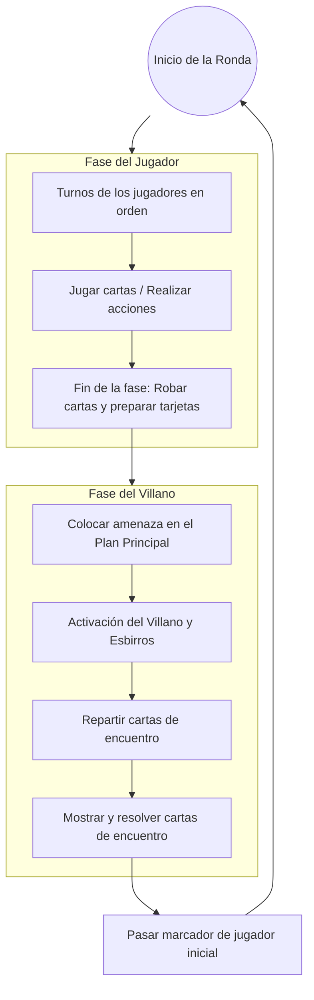

# Estructura del Juego

### Preparación (Setup)
La preparación de una partida de Marvel Champions implica una serie de pasos secuenciales para configurar a los superhéroes, el villano y los mazos correspondientes.

Para ver el procedimiento detallado paso a paso, consulta el **[Apéndice II: Preparación](02-10-APPENDIX-II-SETUP.md)**.

**Véase también**: [Apéndice II: Preparación](02-10-APPENDIX-II-SETUP.md), [Apéndice I: Personalización](02-09-APPENDIX-I-CUSTOMIZATION.md).

### Fases de la ronda (Round Overview)
Una ronda de juego se compone de dos fases: la fase del jugador y la fase del villano. Una vez que ambas fases se han completado, la ronda termina y comienza una nueva ronda.

1. **Fase del jugador**: Los jugadores actúan en orden, juegan cartas y realizan acciones.
2. **Fase del villano**: El villano coloca amenaza, ataca o ejecuta su plan, y se resuelven cartas de encuentro.

### Fase del jugador (Player Phase)
Durante la fase del jugador, los jugadores toman sus turnos siguiendo el orden de jugador.

Después de que cada jugador haya tomado un turno, los jugadores descartan hasta su tamaño de mano o roban hasta el mismo y preparan cada carta agotada.

- Los efectos que duran "hasta el final de la Fase del jugador" terminan después de que los jugadores roben hasta su tamaño de mano y todas las cartas se preparen. Luego, se resuelven los efectos que se resuelven "cuando/después de que termine la Fase del jugador".

**Véase también**: Fin de la fase del jugador, en orden de jugador, jugador, Turno del jugador.

### Turno del jugador (Player Turn)
Durante su turno, un jugador puede realizar las siguientes opciones, en cualquier orden. Cada opción, excepto "cambiar de identidad", puede realizarse tantas veces como el jugador pueda, siempre que pueda pagar los costes requeridos.

- Cambiar de identidad de héroe a alter ego, o de alter ego a héroe. Esta opción solo puede realizarse una vez por turno.
- Jugar una carta de aliado, mejora, apoyo o plan secundario del jugador desde la mano.
- Usar el atributo básico de recuperación de su alter ego (si está en identidad de alter ego) o el atributo básico de ataque o intervención de su héroe (si está en identidad de héroe).
- Usar una carta de aliado que controle en juego para atacar a un enemigo o intervenir en un plan.
- Activar una capacidad de "**Acción**" en:
    a. Una carta en juego que controle.
    b. Una carta de encuentro en juego.
    c. Cualquier carta en juego con texto que permita a ese jugador activar su capacidad de acción.
    d. Una carta de evento en su mano (jugando ese evento).
    - Si la capacidad de acción va precedida de "Héroe" o "Alter ego", el jugador debe estar en la identidad especificada para activar la capacidad.
- Pedir a otro jugador que active cualquier capacidad de "**Acción**" que ese jugador pudiera activar en su propio turno. El otro jugador decide entonces si activa o no la capacidad. (Otro jugador también puede ofrecerse a usar una acción durante el turno del jugador activo).

**Véase también**: aliado, atributo básico, carta de encuentro, evento, identidad, propiedad y control, jugar, jugador, Fase del jugador, apoyo, capacidad activada, mejora.

### Fin de la fase del jugador (End of Player Phase)
Para terminar la fase del jugador, realiza los siguientes pasos:

1. En orden de jugador, cada jugador puede descartar cualquier número de cartas de su mano, y debe descartar hasta su tamaño de mano si tiene más cartas que su valor de tamaño de mano.
2. Cada jugador roba simultáneamente hasta su tamaño de mano.
3. Cada jugador prepara simultáneamente todas sus cartas. Prepara cada carta de encuentro agotada.
4. Cualquier efecto que dure "hasta el final de la Fase del jugador" termina.
5. Resuelve cualquier efecto de "cuando/después de que termine la Fase del jugador".

**Véase también**: descarte, robar, tamaño de mano, efectos duraderos, jugador, Fase del jugador, Turno del jugador, preparar.

### Fase del villano (Villain Phase)
Los pasos de la fase del villano son:

1. **Colocar amenaza**. Coloca la cantidad de amenaza indicada en el campo de aceleración del plan principal sobre ese plan. Si hay iconos o fichas de aceleración activos, también se coloca amenaza adicional igual al número de dichos iconos y fichas en este momento.
2. **Los enemigos se activan**. En orden de jugador, cada jugador resuelve lo siguiente:
    a. El villano se activa contra el jugador. Si el jugador está en identidad de héroe, el villano ataca. Si el jugador está en identidad de alter ego, el villano ejecuta su plan.
    b. Cada esbirro enfrentado con el jugador se activa contra él. Si el jugador está en identidad de héroe, el esbirro ataca. Si el jugador está en identidad de alter ego, el esbirro ejecuta su plan.
       Si varios esbirros deben activarse en ese paso o por un efecto, el jugador elige cuál se activa primero; la elección se repite hasta que solo quede uno, que se activa sin diálogo.
3. **Repartir cartas de encuentro**. Reparte una carta de encuentro a cada jugador. Reparte una carta adicional por cada icono de riesgo en una carta en juego. Estas cartas adicionales se reparten en orden de jugador.
4. **Mostrar cartas de encuentro**. El primer jugador muestra cada una de sus cartas de encuentro, de una en una en el orden en que fueron repartidas, resolviendo cada carta en función de su tipo de carta. Cada jugador repite este proceso en orden de jugador, hasta que no queden cartas de encuentro repartidas.
5. **Pasar el marcador de jugador inicial**. Pasa el marcador de jugador inicial al siguiente jugador en el sentido de las agujas del reloj.
6. **Fin de la fase del villano y de la ronda**.
    a. Cualquier efecto que dure "hasta el final de la Fase del villano" o "hasta el final de la ronda" termina.
    b. Resuelve cualquier efecto de "cuando/después de que termine la Fase del villano" o "cuando/después de que termine la ronda".

**Véase también**: icono de aceleración, activación, ataque (activación de enemigo), repartir, enfrentar, localizar, buscar, icono de riesgo, en orden de jugador, plan principal, esbirro, jugador, mostrar, ejecución de plan (activación de enemigo), amenaza, villano.

### Zona de juego del villano (Villain's Play Area)
La zona de juego del villano (también llamada a veces "área de juego del villano") es el área de juego donde se encuentran el mazo de villano, el mazo de plan principal, el mazo de encuentros, la pila de descartes de encuentros y el dial de puntos de vida del villano.

- Las cartas de entorno y las cartas de plan secundario se colocan en la zona de juego del villano cuando entran en juego.
- Las cartas de accesorio vinculadas a cartas en la zona de juego del villano están en la zona de juego del villano. Las cartas de accesorio vinculadas a cartas en la zona de juego de un jugador no están en la zona de juego del villano.
- Las cartas de esbirro enfrentadas con un jugador están en la zona de juego de ese jugador y no en la zona de juego del villano.
- Las cartas de obligación entregadas a un jugador están en la zona de juego de ese jugador y no en la zona de juego del villano.

**Véase también**: accesorio, pila de descartes, mazo de encuentros, entorno, en juego y fuera de juego, plan principal, esbirro, obligación, villano.

### Mostrar (Reveal)
Durante el paso cuatro de la Fase del villano, cada jugador (en orden de jugador) muestra y resuelve todas las cartas de encuentro boca abajo que se le hayan repartido, de una en una, en el orden en que se le repartieron.
Para mostrar una carta de encuentro, sigue estos pasos:

1. Pon la carta de encuentro boca arriba.
2. Si el tipo de carta de encuentro es:
    - **accesorio (Attachment)**: entra en juego vinculado al elemento del juego especificado por su texto "vincular a". Si no tiene texto de "vincular a", colócalo en la mesa frente al jugador que lo está mostrando. (No está en juego).
    - **entorno (Environment)**: entra en juego en la zona de juego del villano.
    - **esbirro (Minion)**: entra en juego en la zona de juego del jugador que lo muestra. Se considera que se enfrenta a ese jugador.
    - **obligación (Obligation)**: entra en juego en la zona de juego del jugador que lo muestra. Si la carta especifica a un jugador para entregársela, se considera que ese jugador la está mostrando.
    - **plan secundario (Side scheme)**: entra en juego en la zona de juego del villano.
    - **perfidia (Treachery)**: colócala sobre la mesa frente al jugador que la muestra. (No está en juego).
    - **Otro**: colócala sobre la mesa frente al jugador que lo muestra. (No está en juego).
3. Resuelve cada capacidad "**Cuando se muestre esta carta**" en esa carta (incluidas las proporcionadas por las palabras clave).
4. Si la carta es una perfidia, descártala.

Si un jugador recibe instrucciones del texto de una carta para mostrar una carta de encuentro del mazo de encuentros o de cualquier otra área del juego, se aplica este mismo procedimiento de resolución.

- Las respuestas (tanto obligadas como no obligadas) a cualquier paso del mostrado de una carta de encuentro no se resuelven hasta después de que se hayan completado todos los pasos del proceso de mostrado.

**Véase también**: accesorio, elegir (elemento del juego), elegir (opción), repartir, carta de encuentro, entrar en juego, entorno, en orden de jugador, esbirro, obligación, jugador, plan secundario, perfidia, fase del villano.

### En orden de jugador (In Player Order)
Si se instruye a los jugadores a realizar una secuencia "en orden de jugador", el primer jugador realiza su parte de la secuencia primero, seguido de los otros jugadores en el sentido de las agujas del reloj.

- Si una secuencia realizada en orden de jugador no concluye después de que cada jugador haya realizado su parte de la secuencia una vez, la secuencia de oportunidades continúa en el sentido de las agujas del reloj hasta que se complete.
- La frase "siguiente jugador" se refiere siempre al siguiente jugador (en el sentido de las agujas del reloj) en el orden de los jugadores.

**Véase también**: localizar, buscar, jugador, Fase del jugador, Turno del jugador.

### Repartir y mostrar cartas de encuentro (Deal and Reveal Encounter Cards)
Durante el paso tres de la fase del villano, se reparte a cada jugador una carta de encuentro boca abajo.

Si la capacidad de una carta indica a un jugador que se le reparta una carta de encuentro, el jugador toma la carta superior del mazo de encuentros y la coloca boca abajo frente a él. Esta carta no se muestra en este momento. Esta carta se añade a la cola de cartas que ese jugador resuelve durante la fase del villano.

- Si a un jugador se le reparte una carta de encuentro durante el paso tres o cuatro de la fase del villano, la carta de encuentro adicional se añade a la cola de cartas que se están repartiendo y mostrando en esos mismos pasos.

**Véase también**: capacidad, carta de encuentro, mazo de encuentros, jugador, fase del villano.

## Modos de Juego (Modes of Play)
Antes de comenzar una partida de Marvel Champions, los jugadores pueden personalizar su experiencia eligiendo o combinando diferentes modos de juego. Los modos de juego son:

- **Modo Normal**: El modo normal es el modo básico de juego para todos los escenarios.
    - Para jugar en modo normal, sigue las instrucciones de contenido y preparación para el escenario elegido.
- **Modo Principiante (Rookie Mode)**: **Véase**: [Modo Escaramuza](#modo-escaramuza-skirmish-mode).
- **Modo Experto**: El modo experto es una modificación del modo normal para jugadores avanzados que buscan un desafío mayor.
    - Para jugar una partida normal modificada por el modo experto, sigue las instrucciones de contenido y preparación para el escenario elegido, usando las etapas del villano de modo experto indicadas, y añade el conjunto de encuentros Experto al mazo de encuentros.
    - El modo experto también se puede combinar con el modo heroico, el modo escaramuza y/o el modo campaña.
- **Modo Heroico**: El modo heroico es una modificación del modo normal que permite a los jugadores escalar la dificultad del juego.
    - Para jugar una partida normal modificada por el modo heroico, antes de que comience la partida, el grupo de jugadores elige un número de nivel heroico (como nivel heroico 1 o 4). Luego, durante el resto de esa partida, durante el paso tres de cada fase del villano, reparte X cartas de encuentro adicionales a cada jugador, donde X es igual al número de nivel heroico elegido.
    - El modo heroico también se puede combinar con el modo experto, el modo escaramuza y/o el modo campaña.
- **Modo Escaramuza (Skirmish Mode)**: El modo escaramuza (también llamado a veces modo principiante) es una modificación del modo normal que permite a los jugadores acortar la duración de la partida.
    - Para jugar una partida normal modificada por el modo escaramuza, antes de que comience la partida, el grupo de jugadores elige cualquier versión del villano. Durante el paso ocho de la preparación de la partida (Seleccionar Escenario), pon solo la versión elegida del villano en juego y retira todas las demás versiones del mazo de villano de la partida.
    - El modo escaramuza también se puede combinar con el modo experto, el modo heroico y/o el modo campaña.
    - **Véase también**: Modos de juego.
- **Modo Campaña**: El modo campaña permite a los jugadores modificar el modo normal a través de escenarios interconectados que se juegan uno tras otro. No hay dos campañas exactamente iguales, y las reglas para cada una se encuentran en el libro de reglas asociado a la campaña.
    - El modo campaña experto es una modificación del modo campaña para jugadores avanzados que buscan un desafío mayor. Las reglas para cada modo de campaña experto se encuentran en el libro de reglas asociado a la campaña.
    - Cada campaña viene con su propio registro de campaña. El registro de campaña es un historial de qué efectos o cartas persisten entre las partidas de una campaña.
    - Si una carta se retira de una campaña, esa carta ya no se puede usar durante el resto de la campaña, incluso si los jugadores vuelven a intentar el escenario donde esa carta fue retirada.
    - Durante el modo campaña o el modo campaña experto, los jugadores pueden elegir qué otro modo(s) desean jugar para cada escenario individual. La dificultad del modo campaña no requiere que los jugadores jueguen ningún otro modo de juego específico.
    - El modo campaña (y el modo campaña experto) también se pueden combinar con el modo experto, el modo heroico y/o el modo escaramuza.

**Véase también**: carta específica de la campaña, conjunto experto, conjunto Normal.

### Estructura de la ronda (Round Structure)
**Véase**: [Fases de la ronda (Round Overview)](#fases-de-la-ronda-round-overview), [Fin de la fase del jugador](#fin-de-la-fase-del-jugador-end-of-player-phase), [Fase del jugador](#fase-del-jugador-player-phase), [Turno del jugador](#turno-del-jugador-player-turn), [Fase del villano](#fase-del-villano-villain-phase).

### Quedarse sin cartas (Running out of Cards)
**Véase**: [mazo de encuentros](02-03-CARD-TYPES.md#mazo-de-encuentros-encounter-deck), [mazo de jugador](02-03-CARD-TYPES.md#mazo-de-jugador-player-deck).

## Ejemplo de una ronda de juego

### Ejemplo de flujo de turno (Jugador)

1. **Cambiar de identidad**: El jugador puede pasar de Alter Ego a Héroe (o viceversa) una vez por turno.
2. **Jugar cartas**: Pagar el coste en recursos para jugar aliados, mejoras, apoyos o eventos.
3. **Usar atributos básicos**: Agotar la identidad para atacar, intervenir o recuperarse.
4. **Acciones**: Activar capacidades de "Acción" en cartas en juego o eventos de la mano.
5. **Acciones de aliado**: Agotar aliados para atacar o intervenir (sufriendo daño derivado).

### Agotar, agotado (Exhaust, Exhausted)
Si una carta se agota, se gira 90 grados.

- Una carta agotada no puede agotarse de nuevo hasta que esté preparada. Las cartas se preparan normalmente mediante un paso del juego o la capacidad de una carta.
- La capacidad de una carta en una carta agotada está activa y aún puede interactuar con el estado del juego. Sin embargo, si una carta agotada debe agotarse para pagar el coste de usar su capacidad, esa capacidad no se puede usar hasta que la carta esté preparada.

**Véase también**: preparar.

### Preparar (Ready)
Si una carta está preparada, se coloca en posición vertical.

- Las cartas entran en juego en estado preparado, posicionadas de modo que su controlador pueda leer su texto de izquierda a derecha.
- Si se instruye a un jugador a preparar una carta agotada, la carta vuelve a su estado preparado.
- Si hay un coste adicional para que un jugador prepare una carta, ese jugador puede elegir no pagar ese coste. Si no paga el coste, la carta no se prepara.
- Una carta preparada puede agotarse para pagar costes o realizar acciones.
- La mayoría de las cartas se preparan automáticamente al final de la fase del jugador.

**Véase también**: entrar en juego, agotado.

### Barajar (Shuffle)
Barajar es la función del juego de aleatorizar el contenido de un mazo.

- Si se instruye a un jugador a barajar un mazo, ese mazo debe aleatorizarse hasta el punto en que ningún jugador dentro de la partida pueda determinar el orden de las cartas dentro de ese mazo.
- Cada vez que un mazo es buscado por un paso del juego o una capacidad de carta, ese mazo se baraja después de que el paso del juego o la capacidad de la carta complete su resolución.

**Véase también**: mazo de encuentros, mazo de jugador, buscar.

### Charla en la mesa (Table Talk)
Los jugadores tienen permitido y se les anima a hablar entre ellos durante la partida, y a trabajar en equipo para planificar y ejecutar el mejor curso de acción. Los jugadores pueden discutir cualquier cosa que deseen, incluidas las cartas en juego y las cartas en su mano. Los jugadores no están obligados a revelar las cartas en su mano si no desean hacerlo.

- Mientras se resuelve una carta de encuentro con la palabra clave **peligro**, los jugadores no tienen permitido consultarse entre sí.

**Véase también**: palabras clave, peligro, jugador.

### Dar la vuelta (Flip)
Cuando se indique dar la vuelta a una carta, voltéala para que la cara que estaba hacia arriba esté ahora hacia abajo.

- Una carta plegable de "tres caras" se considera que ha dado la vuelta en cualquier momento en que la cara de la carta que está hacia arriba cambie.
- Cuando una carta da la vuelta, si la nueva cara hacia arriba de esa carta tiene:
    - El mismo tipo de carta que la cara anterior, la carta conserva todas las cartas vinculadas, cartas metidas debajo, cartas de estado y fichas.
    - Un tipo de carta diferente al de la cara anterior, todas las cartas vinculadas, cartas metidas debajo, cartas de estado y fichas se descartan de la carta.

**Véase también**: carta de doble cara.
